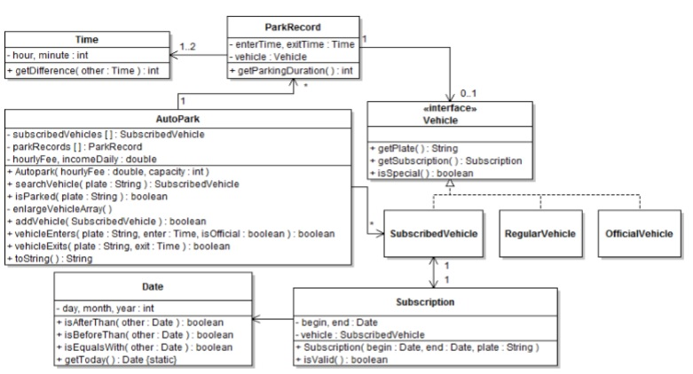

# AutoPark-OOP

**PROJECT DESIGN:** You will implement a complete application for this project work. You must comply with the UML diagram below while coding. Please note that there may be hidden information (members, associations, etc.) in the diagram. Some other details that you need to know and must comply are given below: 

 
**About vehicles:** A regular vehicle is a vehicle that does not have a subscription therefore it is subject to hourly parking fee. A subscribed vehicle always has a subscription, but it may be invalid (Hint: Notice isValid method of a subscription). An official vehicle is a vehicle that belongs to public service, i.e. police cars, ambulances, etc. They do not pay anything for parking; consider them as having permanently valid subscription. 
About subscriptions: A subscription is invalid if today’s date is not within the range of the subscription. The vehicle that is to be associated with a subscription is created in the constructor of the subscription. 

About some methods of the class Autopark: 

**-> addVehicle:** Adds a vehicle to the table, if a vehicle with the same plate does not exist beforehand. 

**-> isParked:** Searches the vector for a vehicle with the given plate. In other words, it checks whether a vehicle with the given plate is parked or not.

**-> vehicleEnters:** First of all, a vehicle that has already parked cannot enter again. When a vehicle enters to the park, its plate is searched within the vehicles array. This array contains vehicles with subscription. If such vehicle is found, the parking record that is to be created and to be added to the array is associated with that vehicle. Otherwise, this means that the vehicle is either a regular vehicle or an official vehicle. In this case, such a vehicle will be created and associated with the parking record. Official vehicles need not to be stored in the vehicles array as they can be easily distinguished by their markings.  vehicleExits: This method determines whether the vehicle with the given plate, which is exiting the park, will pay a parking fee or not. If so, the fee to be paid is the multiplication of parking duration and the hourly fee. The parking fee must be added to the member incomeDaily. Fee is calculated discretely: A regular vehicle that has parked for 55 minutes pays nothing but one that has parked for 1 hours and 35 minutes pays only fee for one hour. 
